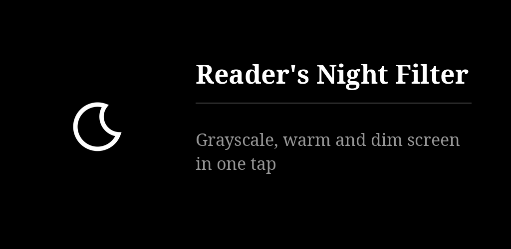

# Reader's Night Filter

One switch turns the screen gray, as warm as the phone allows, and dim: Android's own colour
correction, Night Light and extra dim driven together, and put back as they were when you switch
off. The switch lives in the quick settings, in a home-screen widget and in the app. One of the
[Reader's](https://github.com/funkypitt/readers-launcher) apps.

## Key points

* Three parts, each on or off: grayscale, warm tint (the warmest Night Light the phone accepts),
  dimming (light, medium, strong; Android 12 and later).
* Three switches for the same filter: a quick-settings tile, a widget for any launcher, the app.
* Switching off restores what was there before: your own Night Light strength and schedule,
  your colour correction.
* Needs a permission given once from a computer, with one command the app shows and copies:
  `adb shell pm grant com.freedomfighter.readersnight android.permission.WRITE_SECURE_SETTINGS`.
  No root.
* The limit: Android does not let an app remove blue entirely. The tint stops at the phone's
  warmest Night Light; on a Pixel 10 that leaves about a fifth of the blue light and half of
  the green. A red-only screen needs root.
* No network permission: nothing leaves the phone. Six languages.

More detail: [docs/NOTES.md](docs/NOTES.md).

## Install

[](https://gallaz.ch/eink/#readers-night)

- **F-Droid** (recommended, updates arrive by themselves): add the repository from [gallaz.ch/eink](https://gallaz.ch/eink/#fdroid), or the address `https://funkypitt.github.io/fdroid-repo/repo` in F-Droid.
- **Obtainium**: tap the badge on the phone, or add `https://github.com/funkypitt/readers-night` in Obtainium.
- **APK**: attached to the [latest release](../../releases/latest). No automatic updates.

All three deliver the same file, with the same signature.

Then, once, from a computer with the phone connected by USB (USB debugging on):

```
adb shell pm grant com.freedomfighter.readersnight android.permission.WRITE_SECURE_SETTINGS
```

## Build

```
export JAVA_HOME=/path/to/jdk-21
./gradlew assembleDebug
```

minSdk 28, targetSdk 34.

## Crédits / Credits

© 2026 Pierre Gallaz. Développé avec [Claude Code](https://claude.com/claude-code) (Anthropic).
Licence MIT, voir `LICENSE`.

© 2026 Pierre Gallaz. Developed with [Claude Code](https://claude.com/claude-code) (Anthropic).
MIT licence, see `LICENSE`.
